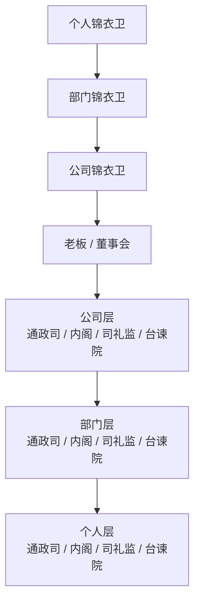

<h1 align="center">🏯 RegentOS · 公司分层治理型多智能体系统</h1>

<p align="center">
  <strong>
    RegentOS 不是一个“让多个 Agent 讨论后交结果”的协作框架。<br>
    它是一套把任务转成案件、把生成转成票拟、把执行纳入审批、把异常纳入监督、把修复纳入命令链的分层治理型多智能体系统。
  </strong>
</p>

<p align="center">
  <sub>
    它覆盖个人层、部门层、公司层三层治理结构。<br>
    除锦衣卫外，每一层都拥有自己的通政司、内阁、司礼监、台谏院；<br>
    只有锦衣卫沿“个人 → 部门 → 公司 → 老板 / 董事会”垂直直属上收。
  </sub>
</p>

<p align="center">
  <a href="#-系统定位">系统定位</a> ·
  <a href="#-核心问题">核心问题</a> ·
  <a href="#-三层治理结构">三层治理结构</a> ·
  <a href="#-锦衣卫垂直直属体系">锦衣卫体系</a> ·
  <a href="#-权限与查看边界">权限边界</a> ·
  <a href="#-部署与模型接入策略">部署策略</a> ·
  <a href="#-当前仓库状态">当前状态</a> ·
  <a href="#-快速开始">快速开始</a>
</p>

<p align="center">
  
  
  
  
  
</p>

## 📌 系统定位

RegentOS 的重点不是单纯提升多 Agent 协作效率，而是把智能系统放进一个可审批、可监督、可诊断、可追责、可受令修复的治理结构中。

它面向这些场景：

- 个人终端上的本地智能工作台
- 部门级协作治理中台
- 公司级风险与执行控制面
- 需要强审批、强监督、强修复边界的 AI 平台

RegentOS 关注的核心问题不是“Agent 怎么做事”，而是：

- 谁负责把需求变成可执行方案
- 谁负责批准执行
- 谁负责过程监督
- 谁负责特别监察和重大异常识别
- 谁有权最终批准修复

## ❗ 核心问题

普通多智能体系统往往擅长角色分工、协作对话、工具调用和任务完成；一旦任务变长、风险变高、涉及多层级组织与本地 / 远程混合环境，就容易暴露治理缺口：

1. 生成和批准混在一起，起草者容易直接推动执行。
2. 审批和监督混在一起，任务一旦开始便缺少独立监督层。
3. 发现问题和修复问题混在一起，失败后只能重试，缺乏正式诊断与归档。
4. 管理层权限边界不清，容易越界查看不归自己负责的问题。
5. 高层被低等级问题淹没，没有分级筛选与逐级上报机制。
6. 修复没有正式命令链，缺少授权、下达、执行、回报闭环。

RegentOS 就是为了解决这些问题。

## 🧭 核心理念

RegentOS 以五种治理功能为主线：

- 通政司：案件化入口
- 内阁：票拟与执行协调
- 司礼监：审批与封驳
- 台谏院：常规监督与稽察
- 锦衣卫：特别监察、重大异常诊断、直属最高层汇报

四条关键分离原则：

1. 生成权和批准权分离。
2. 批准权和监督权分离。
3. 常规监督权和特别监察权分离。
4. 修复建议权和修复执行权分离。

其中最后一点尤为关键：系统可以自动发现问题、自动分析问题、自动提出修复建议，但不能自动修改系统；正式修复必须由老板 / 董事会授权。

## 🏗️ 三层治理结构

RegentOS 采用三层同构架构：

- 个人层
- 部门层
- 公司层

除锦衣卫外，每一层都拥有自己的通政司、内阁、司礼监、台谏院。



### 1. 个人层

部署在员工终端、个人工作空间、本地工作流或个人智能代理环境中，是整个体系的最小治理单元。

- 个人通政司：接收个人任务、建立本地案件、标准化输入。
- 个人内阁：票拟本地方案、拆解执行步骤、调度本地工具与脚本。
- 个人司礼监：审核本地高风险动作、驳回不合规步骤。
- 个人台谏院：监督本地执行流程、记录质量问题与异常调用。
- 个人锦衣卫：侦测本地异常、建立初级问题档案，并将中高等级问题上报部门锦衣卫。

### 2. 部门层

部门层负责部门资源协调、部门内审批、部门内监督和部门级问题汇总。

- 部门通政司：接收部门任务与个人升级事项，建立部门级案件。
- 部门内阁：形成部门级执行方案，协调多人、多小组资源。
- 部门司礼监：审批部门级动作，审查跨个人、跨小组执行方案。
- 部门台谏院：稽察质量、流程、资源、时效与合规，保留监督日志。
- 部门锦衣卫：接收个人锦衣卫上报的问题，做二次分类与高等级上报。

### 3. 公司层

公司层处理跨部门问题、高等级风险、重大变更、重大修复和战略级事项。

- 公司通政司：接收部门上报事项与老板 / 董事会新指令。
- 公司内阁：对跨部门事项进行票拟，形成公司级行动草案。
- 公司司礼监：审批重大动作、重大修复方案和跨部门变更。
- 公司台谏院：监察公司级执行过程，稽察治理是否被规避。
- 公司锦衣卫：形成最高等级问题报告，仅筛选后的重大问题上报老板 / 董事会。

更多组织说明见 [docs/company-architecture.md](docs/company-architecture.md)。

## 🗡️ 锦衣卫垂直直属体系

锦衣卫是本架构中唯一的垂直特别监察系统：

```text
老板 / 董事会
   ↑
公司锦衣卫
   ↑
部门锦衣卫
   ↑
个人锦衣卫
```

它不受各层内阁、司礼监、台谏或部门负责人直接管理，只向上负责，最终只对老板 / 董事会负责。

职责分工：

- 个人锦衣卫：发现本地异常、建立初级问题档案、完成初次分级。
- 部门锦衣卫：汇总本部门个人问题、做二次分类、对部门内特别风险发起专项调查。
- 公司锦衣卫：做跨部门、系统性、战略性风险分析，按老板设定周期或按需汇报。

台谏院与锦衣卫并行存在、互不替代：

- 台谏院负责日常监督、过程稽察、制度性监察、公开留痕。
- 锦衣卫负责特别监察、绕流程检查、重大异常与重大事故调查。

## 🔐 权限与查看边界

RegentOS 不是“谁想看就能看”。

- 员工：只能查看本人任务与本人问题档案，无权查看同部门其他个人档案。
- 部门管理层：只能查看自己负责业务范围内的问题，无权查看其他部门问题。
- 公司管理层：只能查看自己分管业务条线的问题，无权横向查看非自己负责业务。
- 锦衣卫：拥有高于普通管理层的查看能力，但用于监察、诊断、归档和上报，而不是开放式浏览。
- 老板 / 董事会：拥有全公司、全层级、全等级问题查看权。

当前 MVP 已把这套边界固化为最小权限矩阵，API 可通过 `GET /api/governance/permissions` 查看。

## 🚨 问题分级与上报机制

RegentOS 使用四级问题体系：

- `L1`：局限于个人层，可在本层快速修复。
- `L2`：影响部门内小组或局部业务，需要部门资源介入。
- `L3`：影响跨小组、跨系统或核心业务，需要公司层协调或批准。
- `L4`：影响多个部门，涉及重大风险、合规、安全或品牌问题，需要老板 / 董事会决策。

上报路径遵循逐级升级和逐级汇总：

- 个人锦衣卫定时向部门锦衣卫提交汇总报告。
- 部门锦衣卫定时向公司锦衣卫提交部门级问题摘要，紧急问题实时升级。
- 公司锦衣卫按老板设定周期形成特别监察简报，只筛选最高等级、最关键问题汇报给老板 / 董事会。

## 🛠️ 修复命令与逐级下达机制

修复建议不等于修复执行。正式修复动作必须经过授权。

修复命令只能由老板 / 董事会下达，其路径是：

```text
老板 / 董事会
→ 公司锦衣卫 / 公司通政司
→ 公司内阁票拟修复方案
→ 公司司礼监审定修复执行令
→ 部门层接令
→ 个人层执行
```

结果回报路径：

```text
个人层执行完成
→ 部门层汇总
→ 公司层整理
→ 老板 / 董事会
```

这保证了命令链、责任链、反馈链都清晰。

## 🌐 部署与模型接入策略

RegentOS 不是只能接远程 API，也不是只能跑本地模型。每个 Agent 最终都可以绑定三类模型来源：

- 远程 API 模型
- 本地蒸馏 / 量化 / 专项配置模型
- 本地完整大模型

一句话部署规则：

- 本地部署：接触终端、接触个人上下文、拦截本地动作。
- 远程内网服务：跨人、跨部门、跨层级的治理、归档与控制。
- 远程 API：高质量推理、票拟、总结、驳回说明、修复建议。

详细部署建议见 [docs/deployment-strategy.md](docs/deployment-strategy.md)。

## 📂 当前仓库状态

这个仓库当前不追求“一次把所有个人层、部门层、公司层、控制台都做完”，而是先把下面 5 件事做扎实：

1. 案件创建与状态流转
2. 司礼监审批 / 封驳骨架
3. 台谏院异常监督骨架
4. 锦衣卫修复建议与修复受令骨架
5. 最小卷宗时间线与导出

`文渊阁中枢` 看板属于下一阶段，而不是当前仓库的既成事实。

### 当前仓库里有什么

| 模块 | 当前作用 |
| --- | --- |
| `apps/api` | 提供案件创建、查询、时间线、状态流转与人工干预接口 |
| `core/registry` | 管理案件对象、状态和元信息 |
| `core/events` | 提供内存事件总线与事件 schema |
| `core/state_machine` | 维护合法状态转换 |
| `core/permissions` | 维护角色消息与查看边界矩阵 |
| `core/orchestrator` | 驱动最小案件流转与修复受令链 |
| `core/replay` | 导出案件时间线 JSON |
| `agents/*/SOUL.md` | 定义关键治理角色的职责边界 |
| `scripts/seed_demo_data.py` | 向运行中的 API 注入原型演示数据 |

## 🧪 快速开始

### 本地运行

```bash
python3 -m venv .venv
source .venv/bin/activate
pip install -r requirements.txt
uvicorn apps.api.main:app --reload
```

默认访问：

- `GET http://127.0.0.1:8000/healthz`
- `GET http://127.0.0.1:8000/api/cases`
- `POST http://127.0.0.1:8000/api/cases`
- `GET http://127.0.0.1:8000/api/agents`
- `GET http://127.0.0.1:8000/api/models/runtime-capabilities`

### 演示数据

先启动 API，再执行：

```bash
python scripts/seed_demo_data.py
```

### 运行测试

```bash
pytest tests
```

### Docker

```bash
docker compose up
```

当前 `docker-compose.yml` 只覆盖 API 与 worker 原型，不包含 Dashboard。

## 📡 最小接口示例

### 创建案件

```bash
curl -X POST http://127.0.0.1:8000/api/cases \
  -H "Content-Type: application/json" \
  -d '{
    "title": "企业知识库系统设计",
    "content": "FastAPI + PostgreSQL + 全文搜索 + 权限分级",
    "priority": "high",
    "submitted_by": "imperial_user"
  }'
```

### 查看时间线

```bash
curl http://127.0.0.1:8000/api/cases/{case_id}/timeline
```

### 推进最小流转

```bash
curl -X POST http://127.0.0.1:8000/api/cases/{case_id}/accept
curl -X POST http://127.0.0.1:8000/api/cases/{case_id}/submit-for-approval
curl -X POST http://127.0.0.1:8000/api/cases/{case_id}/approve
curl -X POST http://127.0.0.1:8000/api/cases/{case_id}/dispatch
curl -X POST http://127.0.0.1:8000/api/cases/{case_id}/start-execution
```

### 模拟封驳或异常

```bash
curl -X POST http://127.0.0.1:8000/api/cases/{case_id}/reject \
  -H "Content-Type: application/json" \
  -d '{"reason": "测试覆盖不足"}'

curl -X POST http://127.0.0.1:8000/api/cases/{case_id}/repair-pending \
  -H "Content-Type: application/json" \
  -d '{"reason": "dependency corruption", "actor": "jinyiwei"}'
```

### 人工干预

```bash
curl -X POST http://127.0.0.1:8000/api/cases/{case_id}/pause
curl -X POST http://127.0.0.1:8000/api/cases/{case_id}/resume
curl -X POST http://127.0.0.1:8000/api/cases/{case_id}/freeze
curl -X POST http://127.0.0.1:8000/api/cases/{case_id}/cancel
curl -X POST http://127.0.0.1:8000/api/cases/{case_id}/repair-order \
  -H "Content-Type: application/json" \
  -d '{
    "strategy": "patch_then_rerun",
    "reason": "critical dependency issue",
    "scope": "executor_pool/api_builder"
  }'
curl -X POST http://127.0.0.1:8000/api/cases/{case_id}/rerun
```

## 🔄 状态机

主流程：

```text
created
→ accepted
→ planning
→ internal_review
→ submitted_for_approval
→ approved / rejected / escalated
→ dispatched
→ executing
→ reporting
→ archived
```

异常分支：

```text
executing
→ repair_pending
→ repair_authorized
→ rerunning
→ executing
```

核心约束：

- 未经 `approved`，不得进入 `dispatched`
- 未经 `repair_authorized`，不得进入 `rerunning`
- 非法状态跳转会被拒绝

## 📘 关键术语

- 案件化：把原始任务变成一个有 `case_id`、状态、时间线和元信息的正式对象
- 票拟：把原始旨意转成可审批、可执行、可追责的正式草案
- 封驳：方案不合格时，正式退回返工，而不是仅给出 warning
- 稽察：对执行过程做独立监督，检查跳步、越权、滞塞和偏航
- 修复受令：可以自动发现问题、自动分析问题、自动提出修复建议，但不能自动修改系统；修复必须有老板 / 董事会命令

## 🧩 我们和常见多智能体框架的区别

常见多智能体框架主要解决“怎么做事”，而 RegentOS 重点解决：

- 票拟是否成立
- 审批是否通过
- 执行过程是否偏航
- 异常是否被正式记录
- 修复是否得到授权
- 管理层查看边界是否清晰
- 最高层是否保留真正的修复主权

也就是说，RegentOS 关注的是“做事之后谁审批、谁监督、谁诊断、谁批准修复”。

## 🗺️ 开发路线

第一阶段：基础控制面

- `core/state_machine`
- `core/permissions`
- `core/events`
- `apps/api/main.py`

第二阶段：治理角色骨架

- `core/orchestrator`
- `agents/cabinet`
- `agents/silijian`
- `agents/censorship`
- `agents/jinyiwei`

第三阶段：分层扩展

- 个人层 / 部门层 / 公司层统一案件模型
- 锦衣卫垂直链
- 问题分级与跨层升级机制
- 管理层查看边界落地

第四阶段：中枢与回放

- 文渊阁中枢
- 更完整的卷宗回放
- 可观测性与审计增强

## 🎯 适用场景

- 个人终端上的本地智能工作台
- 部门级任务治理与协作中台
- 公司级高风险任务治理
- 复杂代码生成与重构
- 多工具自动执行
- 长链条研究与分析
- 企业内部流程编排
- 需要强监督、强归档、强修复主权的 AI 平台

## 📄 License

MIT

